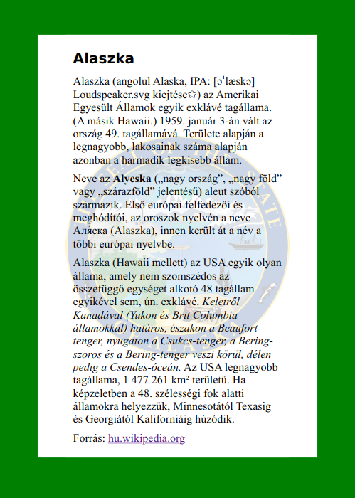
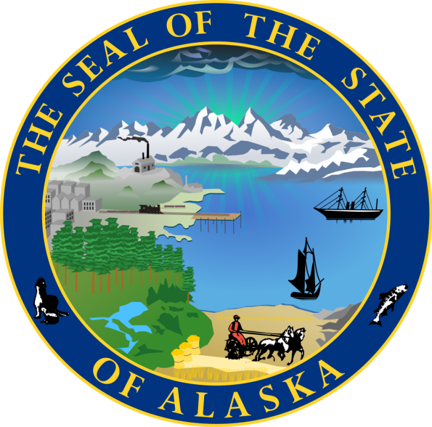

# CSS0601

* Szerző: Sallai András
* Copyright © 2014, Sallai András
* Szerkesztve: 2014-2024
* Licenc: CC BY-SA 4.0
* Web: https://szit.hu

Ez egy egyszerű HTML és CSS alapú weblap, amely Alaszka államot mutatja be.

## Fájlok
- `index.html` - Az oldal HTML szerkezete.
- `style.css` - A megjelenésért felelős stíluslap.
- `feladat_minta_0402.png` - A háttérkép.

## Használat
Egyszerűen nyisd meg az `index.html` fájlt egy böngészőben.

## Tesztelés
A teszteléshez a `pytest` használható. Lásd `test_webpage.py`.

